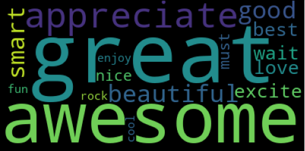

# Author
Jackson Robbins: https://github.com/Jmanitou
# Overview
### Here is the [presentation](https://docs.google.com/presentation/d/11-pZnVmcu7Bm9gXcQhVx-V0YTC-wZ3He-wtebtLNhNM/edit?usp=sharing).
# Project Structure
```
├── data
│   ├── final_data.csv
│   └── twitter_data.csv
├── images
│   ├── Emotion_GraphV1.PNG
│   ├── Emotion_GraphV2.PNG
│   ├── positive_wordcloud.PNG
│   ├── negative_wordcloud.PNG
│   ├── Positive_Rate.PNG
│   └── Tweet_Per_Product.PNG
├── .gitignore
├── README.md
├── Presentation.pdf
└── Apple_Google_NLP.ipynb
```
# Business Understanding
I work for a data company where we are hired by different companies who display their products at different conventions. For this project specifically we are working with SXSW to help them diagnose products shown at their convention.

I was instructed to decode the responses of products displayed at South by South West (SXSW), see which words on twitter signify positive or negative sentiment, and seeing which product was seen to be the most favorable at SXSW.
# Data Understanding and Analysis
This project analyzes [tweets talking about SXSW products](https://data.world/crowdflower/brands-and-product-emotions). I first ran NLP on the tweet data to break down most common words for positive and negative tweets. I then identified what product and emotion a tweet was talking about. I next converted categorical columns to numeric columns and used those columns to identify recall scores for positive and negative tweets using our algorithm. I finished with scoring the products by the ratio of positive to all tweets with emotion.

Tweet data was sourced from a past SXSW (before 2014). Tweets were found if they included SXSW and an Apple or Google product. Contributors manually evaluated tweets about different brands and products. They were asked to decide if the tweet expressed positive, negative or no emotion. If some emotion was expressed, they were asked to say which brand and product.
# Visualizations





# Conclusion
Positive Words: great awesome like appreciate good beautiful smart excite wait best love nice must enjoy fun rock cool 

Negative Words: dead insane headache long fail hate suck fascist fade crashing

32% Recall for Positive Tweets 16% Recall for Negative Tweets

Android App Tweets were seen to have the best ratio of positive to all tweets with emotion
# Next Steps
See what business practices corresponds with different emotion tweets. This will allow businesses to improve or keep with the same practices that allowed them to get positive sentiment.

Look at more than one social media and other conventions/events. See if our words are correct across the board or if there are different words based on different social media apps. It also would be beneficial to see if there are any other negative words we could add to our list with more data

Look into no emotion tweets and research how to convert them to positive ones. It is easier for companies to convert neutral rather than negative tweets and it would be beneficial for companies to understand how to direct their initiatives in further conventions.
